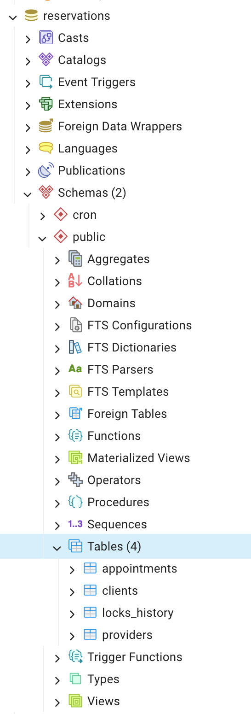
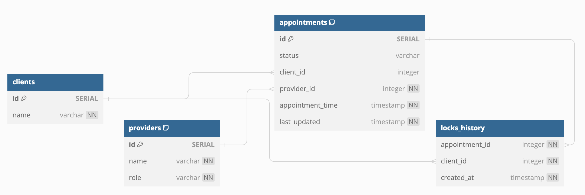
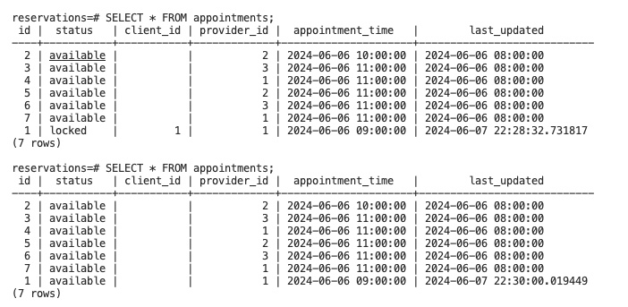

# Reservations API 

Submitted by: Dave Lindqvist

## Requirements
To run this repository, you will need [Docker Desktop](https://docs.docker.com/compose/install/):

Docker and Docker Compose: Ensure Docker is installed on your system. The repository has been tested with Docker version 26.1.1 and above, and Docker Compose version 2.27.0-desktop.2 and above. 

Operating System: The setup creating this repo was with a  macOS (Sonoma 14.5)

## Instructions for setup

1. Run `docker compose up --build` where `compose.yaml` exists
2. Tests are automatically ran. However, it is possible to manually test by running `npm run test` in the `api` directory
3. API runs on port `8000`
4. Postgres runs on port `5433`
5. PG Admin runs on port `5050`

## PG admin instructions
1. Once you see `pgadmin4_container` running successfully, head to [localhost:5050](http://localhost:5050)
2. Login with
    - EMAIL: admin@admin.com
    - PGADMIN_DEFAULT_PASSWORD: admin
3. Click `Add New Server`
4. Enter 
    - Any `name`
    - Host name/address = `db`
    - Username = `postgres`
    - Password = `password`
5. You'll then find the tables through `Database > reservations > Schemas > public >  Tables` as seen below

## Database schema - made with [DBDiagram.io](https://dbdiagram.io/)

## Objectives

- Allow providers to submit times of availability
- Allow clients to retrieve list of available 15-min appointment slots
- Allow clients to reserve an available appointment slot
- Allow clients to confirm reservation
- Reservations expire after 30 minutes if not confirmed
- Reservations must be made at least 24 hours in advance

## Endpoints

`Base URL = http://localhost:8000/api/v1`

|  HTTP Request   | Method | Description | Body Example | Response Example |
| :--: | :--: | :--: | :--: | :--: | 
| `/appointments/{clientId}` | `GET` | Confirms client of their reservation | N/A| <pre lang="json">[ { "id": 1, "provider_id": 1, "client_id": 1, "status": "reserved", "appointment_time": "2024-06-07T15:00:00Z", "last_updated": "2024-06-06T04:31:56.604Z" } ]</pre> |
| `/providers/{providerId}/appointments` | `GET` | Client retrieves available provider slots | N/A | <pre lang="json">[ { "id": 1, "provider_id": 1, "client_id": null, "status": "available", "appointment_time": "2024-06-07T15:00:00Z", "last_updated": "2024-06-06T04:31:56.604Z" }, { "id": 2, "provider_id": 1, "client_id": null, "status": "available", "appointment_time": "2024-06-07T16:00:00Z", "last_updated": "2024-06-06T04:31:56.604Z" } ] </pre> |
| `/providers/{providerId}/appointments` | `POST` | Submit provider appointments in 15-minute intervals | <pre lang="json"> { "providerId": 1, "date": "2024-08-13", "startTime": "08:00:00", "endTime": "15:00:00" } </pre> | <pre lang="json"> { "message": "Availability slots submitted successfully", "appointments": [ { "id": 8, "status": "available", "client_id": null, "provider_id": 1, "appointment_time": "2024-08-15T08:00:00.000Z", "last_updated": "2024-06-10T03:57:42.876Z" } ... ] } </pre> |
| `/clients/{clientId}/appointments/{appointmentId}` | `GET` | Views a specific appointment which will lock appointment record in database (not technically idempotent) | N/A | <pre lang="json">[ { "appointment_time": "2024-06-07T15:00:00Z", "last_updated":  "2024-06-06T03:57:42.876Z", "client_id": 1, "id": 1, "provider_id": 1, "status": "locked" } ]</pre> |
| `/clients/{clientId}/appointments/{appointmentId}` | `PATCH` | Reserves appointment after viewing | N/A | <pre lang="json">[ { "appointment_time": "2024-06-07T15:00:00Z", "last_updated":  "2024-06-06T03:57:42.876Z", "client_id": 1, "id": 1, "provider_id": 1, "status": "reserved" } ]</pre>  |

## Notes and thoughts

My largest focus (yet unintentional) on this submission was creating an environment where the reviewer could easily run this on their machine. It wasn't until the latter half of this project where I was able to get the backend logic to work. 

While there are some tests within the `api` folder, you will also see a sub-directory of an integration folder. There are currently only unit tests around the endpoints. I hoped to have done [integration tests](https://node.testcontainers.org/quickstart/) too to view the affects of the backend functions to the database.

I used postgres for a few reasons. The first being that this is a database the reviewer is already familiar with. The second being that postgres can do [_a lot_](https://www.amazingcto.com/postgres-for-everything/) of things. I was successfully able to implement the PG_Cron extension within postgres. Of course, it didn't come without some headaches to get it to work. You will notice how I have a helper function called `pgCron`in `./api/src/helpers/pgCron.ts` to help continue initializing the database with the CRON job.

One limitiation I found with PG_Cron is its granularity. The lowest unit of time is scheduled at the minute level. As a consequence, the requirement around reservations expiring may exceed past 59 seconds. I'd like to think the difference of 30 minutes to 30 minutes and 59 seconds isn't a big deal in the grand scheme of things. (You will notice in `./database/init.sql` that the interval is `1 minutes` instead of `30 minutes`. This is only for manual testing instead of waiting `30 minutes` in a production setting.)

Below is a screenshot of what you may see while testing this app

Additionally, I decided to go in the route of database seeding via `init.sql` as I found it easier to have it within this Docker setup.

The `.env` are purposefully exposed to help set everything up, when in reality, it should be hidden or uplodaded somewhere safer. The duplication of the `.env` in the root directory and within the `/api` is also on purpose, since the Dockerfile/Docker-Compose file had issues finding it if it was only in one directory and not both.

I have PG Admin for the reviewers convenience. I thought this was going to help me along the way, but, in hindsight, I barely used it and felt more inclined to use the command line terminal to access postgres instead.

I considered working with a dependency that would help convert timezones in the case that a provider and client are in different timezones. Once I started working with the backend, I felt it wasn't a big priority for this assessment. However, it would be if this was for production.

## Stretch Goals
- Redis &rarr; Distributed lock with TTL (Time To Live) without using pg_cron
  - Scenario where appointment slot is being looked at. Locks unique identifier of appointment slot with a predefined TTL. If client completes the booking, then database is updated to "booked" and lock is released upon TTL. If TTL expires without booking, Redis releases lock and the appointment slot becomes available once again.
- Authentication / Authorization
  - `hasura` headers

References:
1. [Docker, Postgres, Node, Typescript Setup](https://dev.to/chandrapantachhetri/docker-postgres-node-typescript-setup-47db)
2. [PG_Cron in Docker](https://eduanbekker.com/post/pg-partman/)